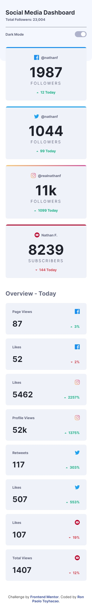
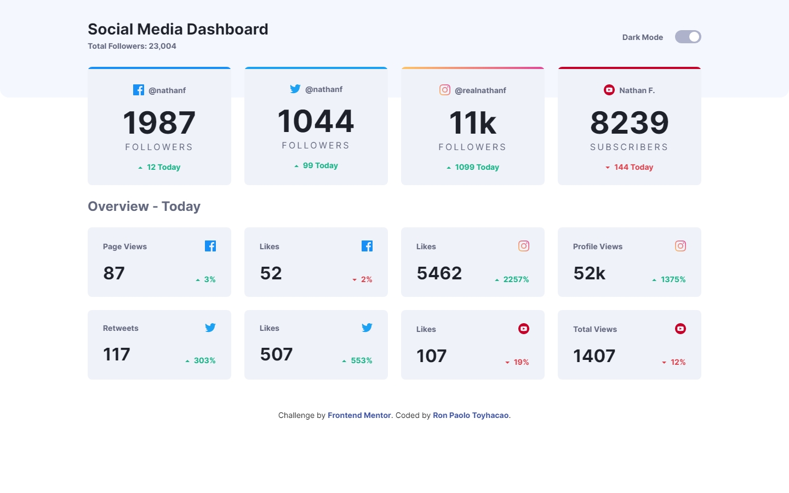

# Frontend Mentor - Social media dashboard with theme switcher solution

This is a solution to the [Social media dashboard with theme switcher challenge on Frontend Mentor](https://www.frontendmentor.io/challenges/social-media-dashboard-with-theme-switcher-6oY8ozp_H). Frontend Mentor challenges help you improve your coding skills by building realistic projects. 

## Table of contents

- [Overview](#overview)
  - [The challenge](#the-challenge)
  - [Screenshot](#screenshot)
  - [Links](#links)
- [My process](#my-process)
  - [Built with](#built-with)
  - [What I learned](#what-i-learned)
  - [Continued development](#continued-development)
- [Author](#author)
- [Acknowledgments](#acknowledgments)

## Overview

### The challenge

Users should be able to:

- View the optimal layout for the site depending on their device's screen size
- See hover states for all interactive elements on the page
- Toggle color theme to their preference

### Screenshot




### Links

- Solution URL: [https://github.com/rontoyhacao/Social-media-dashboard-with-theme-switcher](https://github.com/rontoyhacao/Social-media-dashboard-with-theme-switcher)
- Live Site URL: [https://social-media-dashboard-with-theme-switcher-rontoyhacao.vercel.app/](https://social-media-dashboard-with-theme-switcher-rontoyhacao.vercel.app/)

## My process

### Built with

- Semantic HTML5 markup
- CSS custom properties
- Javascript
- [Sass](https://sass-lang.com/)
- Flexbox
- CSS Grid
- Mobile-first workflow

### What I learned

I was able to understand how the dark mode feature works in a website through this project. The concept of adding it is quite simple similar to how the hamburger menu on mobile is done. The goal is to add a class to the `body` using the `classList` method to be used as another styling in CSS to change the background and colors of the elements.

```js
const body = document.querySelector('body');
const themeSwitcher = document.querySelector('#dark-toggle');
const slider = document.querySelector('.slider');
```

As you can see above, I declare first the required elements in Javascript using the document method `querySelector()`. I declared the toggle `#dark-toggle` as `themeSwitcher` and this will be used to manipulate the DOM and add a class to the `body`. 

```js
themeSwitcher.addEventListener('click', darkModeToggle)
slider.addEventListener('keypress', () => {
    themeSwitcher.checked = !themeSwitcher.checked
    darkModeToggle()
});
```

I added an `addEventListener()` method on the `themeSwitcher` variable to have the function `darkModeToggle()`, I also added another `addEventListener` method with a `keypress` event on the `slider` variable for accessibility. The `darkModeToggle()` function will contain the `classList` method to add `dark-mode` class on the body including the animations. See below:

```js
const cards = document.querySelectorAll('.card-container');
function darkModeToggle() {
    const len = cards.length;
    if (themeSwitcher.checked) {
        darkMode()
        for (let i = 0; i < len; i++) {
            cards[i].style.transition = (400 + (3 - i % 4) * 200).toString() + 'ms';
        }
    } else {
        lightMode()
        for (let i = 0; i < len; i++) {
            cards[i].style.transition = (400 + (i % 4) * 200).toString() + 'ms';
        }
    }
    window.setTimeout(() => {
        for (let i = 0, len = cards.length; i < len; i++) {
            cards[i].style.transition = '.3s';
        }
    }, 1000);
}

function darkMode() {
    body.classList.add('dark-mode');
}

function lightMode() {
    body.classList.remove('dark-mode');
}
```

The `dark-mode` class will be used for styling to add the dark colors on the elements.

```css
.dark-mode {
    background: $Very-Dark-Blue;
    h1,
    h2 {
        color: $White;
    }
    header {
        background: $Very-Dark-Blue2;
        .header-container span {
            color: $Desaturated-Blue;
        }
        .toggle {
            color: $Desaturated-Blue;
        }
    }
    .card-container {
        background: $Dark-Desaturated-Blue;
        .username-container__username {
            color: $Desaturated-Blue;
        }
        .counter-container {
            &__counter {
                color: $White;
            }
            &__label {
                color: $Desaturated-Blue;
            }
        }
        .label-container__label {
            color: $Desaturated-Blue;
        }
        .stats-container__stat {
            color: $White;
        }
        &:hover {
            background: #303755;
        }
    }
    .attribution {
        color: $White;
    }
}
```

### Continued development

I had a fun doing this project especially with adding the dark mode feature. I'm not sure if there is a better way of implementing this but I could definitely use this for my future projects.

## Author

- Website - [Ron Paolo Toyhacao](https://www.your-site.com)
- Frontend Mentor - [@rontoyhacao](https://www.frontendmentor.io/profile/rontoyhacao)
- Twitter - [@rontoyhacao](https://twitter.com/rontoyhacao)

## Acknowledgments

I would like to thank and give acknowledgements to [@StephenBuley
](https://www.frontendmentor.io/profile/StephenBuley) for this solution to add accessibility on the toggle as well as [Bonrey](https://github.com/Bonrey) for his solution to add animations in transitioning themes. Their work has been a huge help for me to successfully achieve this project.
